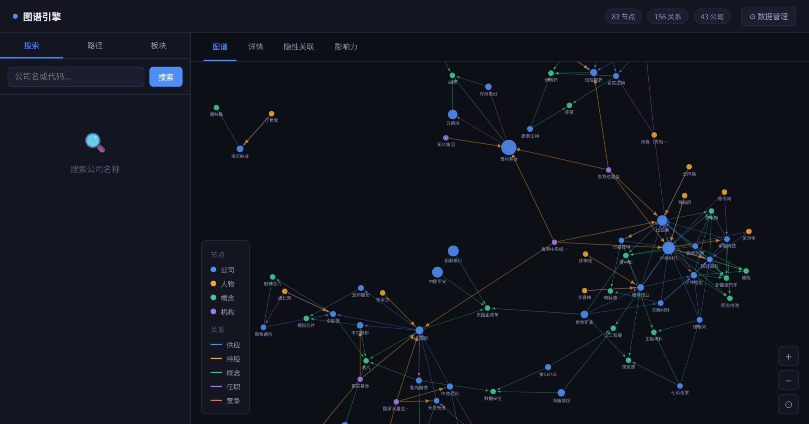
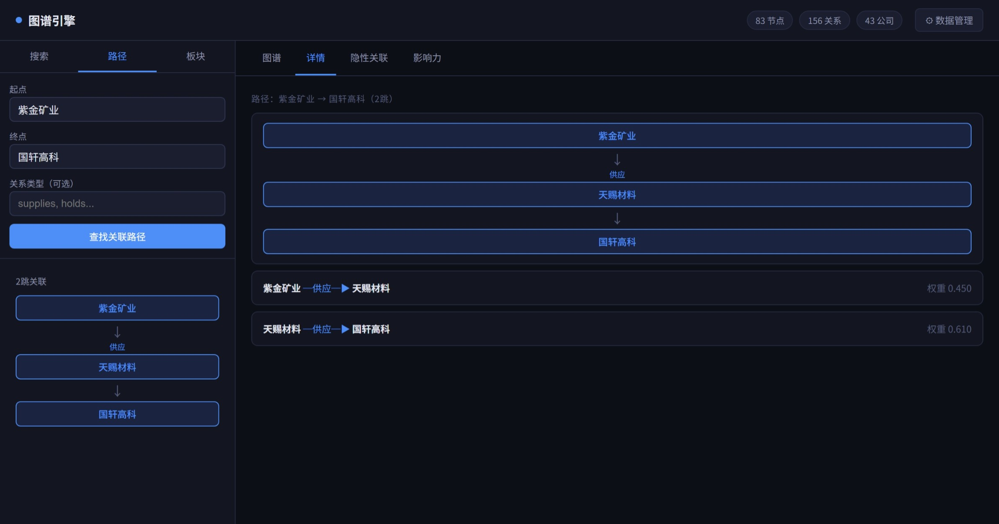
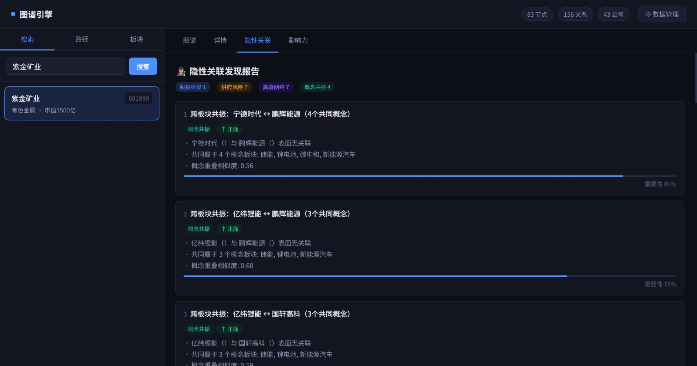

# 🕵️ 关系图谱引擎

> 把分散的公开信息连成图，让算法找到人工找不到的隐性关联——
> 谁的核心人员悄悄去了竞争对手、哪个小实体是多家巨头的唯一依赖方、哪两个"不相关"的节点其实深度绑定。
>
> 本地运行 · 零API调用 · 结果完全可解释

  

---

## 它能发现什么

这不是另一个数据看板。它做的一件事是：**把关系数据连成图，然后用确定性算法找到人眼看不到的结构性信号。**

适用于任何存在复杂关系网络的场景——企业竞争情报、供应链风险、投资研究、学术合作网络、组织关系分析……

以下是用内置Demo数据跑出的真实发现：

**① 人员隐性网络**
```
关键人物 张磊 同时担任：
  公司A（历史任职）→ 公司B（在任）→ 公司C（在任）

三家公司的直接关系表里没有任何重叠，
但通过任职图，一条隐性信息通道清晰可见。
```

**② 单点风险节点**
```
供应商X（小体量）是以下机构的关键依赖方：
  → 龙头A   依赖度 87%
  → 龙头B   依赖度 76%
  → 龙头C   依赖度 58%

风险放大倍数：17x
一旦出问题，波及下游数倍于自身的规模。
这个风险在直接关系数据里完全不可见。
```

**③ 隐性控制桥梁**
```
实体A ←→ 实体B
直接关联：无任何重叠

穿透后：
两者均受同一控制方间接影响（穿透比例均超5%）
这条关联在任何单一数据表的直接关系里都查不到。
```

**④ 跨类别结构共振**
```
实体P ↔ 实体Q
直接关系无连接

共同属于4个相同的细分类别，结构相似度：0.56
这类高重叠的节点对，往往在外部事件驱动时出现联动效应。
```

---

## 与现有方案的区别

| | 传统数据库查询 | 大模型分析 | 本项目 |
|---|---|---|---|
| 能发现隐性关联 | ✗ | ✗ | ✓ |
| 结果可解释/可追溯 | 部分 | ✗ | ✓ 每条路径有依据 |
| 数据出本地网络 | ✓ | ✓ | ✗ 全本地 |
| 运营成本 | 订阅费 | token费用 | 零 |
| 结果稳定性 | ✓ | 随机性 | ✓ 确定性计算 |

核心技术选择：**确定性图推理**，不依赖大模型。相同输入永远相同输出，每条结论都有完整的推理路径。





---

## 快速开始

**环境要求：Python 3.9+（图引擎核心为纯标准库，无需额外依赖）**

```bash
git clone https://github.com/liftkkkk/graph-engine
cd graph-engine

# 命令行模式（直接跑Demo，输出分析结果 + HTML图谱）
python main_v2.py

# Web模式（交互界面 + 数据管理）
pip install flask
python app.py
# 浏览器打开 http://localhost:5000
```

第一次运行会自动生成Demo数据，无需任何配置。

---

## 界面功能

启动后访问 `http://localhost:5000`

- **图谱视图** — D3力导向图，支持缩放/拖拽/节点高亮，点击边显示关系类型和权重
- **路径查询** — 输入两个实体，找出之间的最短关联路径和每一跳的关系类型
- **类别传导** — 选择一个类别节点，输出受影响的关联实体排序
- **隐性关联扫描** — 一键扫描全图，输出带证据链的结构性发现报告
- **影响力排名** — 基于PageRank的全图节点影响力排名
- **数据管理** (`/data.html`) — 上传自己的CSV替换Demo数据，图谱立即重建

---

## 接入你自己的数据

系统读取五类CSV文件，通过Web界面上传或直接放入 `data/user/` 目录，图谱自动重建。

| 文件名 | 内容 | 必填字段 |
|--------|------|---------|
| `companies.csv` | 核心实体基础信息 | `code, name` |
| `shareholding.csv` | 持有/归属/依赖关系 | `holder_id, holder_name, holder_type, company_code, ratio` |
| `supply_chain.csv` | 上下游/供需关系 | `supplier_code, customer_code, relation_type` |
| `concepts.csv` | 类别/标签归属 | `concept_id, concept_name, stock_code` |
| `executives.csv` | 人员关联记录 | `person_id, person_name, company_code, title` |

CSV模板可在Web界面一键下载，或调用 `GET /api/data/download/<data_type>`。

---

## 核心算法

| 算法 | 用途 | 复杂度 |
|------|------|--------|
| BFS最短路径 | 关联路径追溯 | O(V+E) |
| DFS全路径枚举 | 多路径关联分析 | O(V+E) |
| 归属穿透递归 | 间接控制关系计算 | O(depth × E) |
| 带衰减分数传播 | 类别扩散、风险传导评分 | O(hops × E) |
| PageRank迭代 | 全图影响力排名 | O(iter × E) |

**四类隐性关联发现逻辑：**

- **隐性控制桥梁** — 直接关系无重叠，穿透后指向同一控制方
- **单点风险节点** — 小体量节点是多个大节点的唯一依赖方，风险被放大
- **人员隐性网络** — 同一人跨组织关联，尤其是跨类别跨领域
- **结构共振对** — 直接关系无连接，但共享3个以上相同细分标签

---

## API速查

```
GET  /api/search?q=关键字                  # 搜索实体
GET  /api/company/<id>                     # 实体详情+邻居
GET  /api/path?from=实体A&to=实体B         # 关联路径查询
GET  /api/supply_chain/<id>                # 上下游穿透
GET  /api/shareholders/<id>                # 归属关系穿透
GET  /api/concept/<id>                     # 类别传导分析
GET  /api/hidden?company_id=<可选>         # 隐性关联扫描
GET  /api/influence                        # PageRank排名
POST /api/data/upload/<data_type>          # 上传CSV数据
GET  /api/data/download/<data_type>        # 下载CSV模板
POST /api/data/reset                       # 恢复Demo数据
```

---

## 项目结构

```
graph-engine/
├── app.py                    # Flask Web服务
├── main_v2.py                # 命令行入口
├── core/
│   └── graph_engine.py       # 图引擎（节点/边/BFS/DFS/PageRank）
├── data/
│   ├── loader.py             # CSV加载器
│   ├── llm_data_generator.py # Demo数据生成
│   └── user/                 # 用户上传数据（优先于Demo）
├── modules/
│   ├── analyzers.py          # 四大分析模块
│   └── hidden_connections.py # 隐性关联发现引擎
├── static/
│   ├── index.html            # 主界面（D3图谱）
│   └── data.html             # 数据管理界面
└── visualization/
    └── html_export.py        # 离线HTML图谱导出
```

---

## Roadmap

- [ ] 增量更新机制，新数据只更新变化节点
- [ ] 事件驱动预警（监控关键节点状态变更）
- [ ] 相似实体推荐（基于图结构相似度）
- [ ] 自定义规则引擎（用户定义隐性关联判断逻辑）
- [ ] 导出结构化分析报告（PDF/Markdown）

---

## License

MIT — 随便用，欢迎 PR 和 Issue。

如果这个工具帮你发现了有价值的信息，欢迎给个 ⭐
